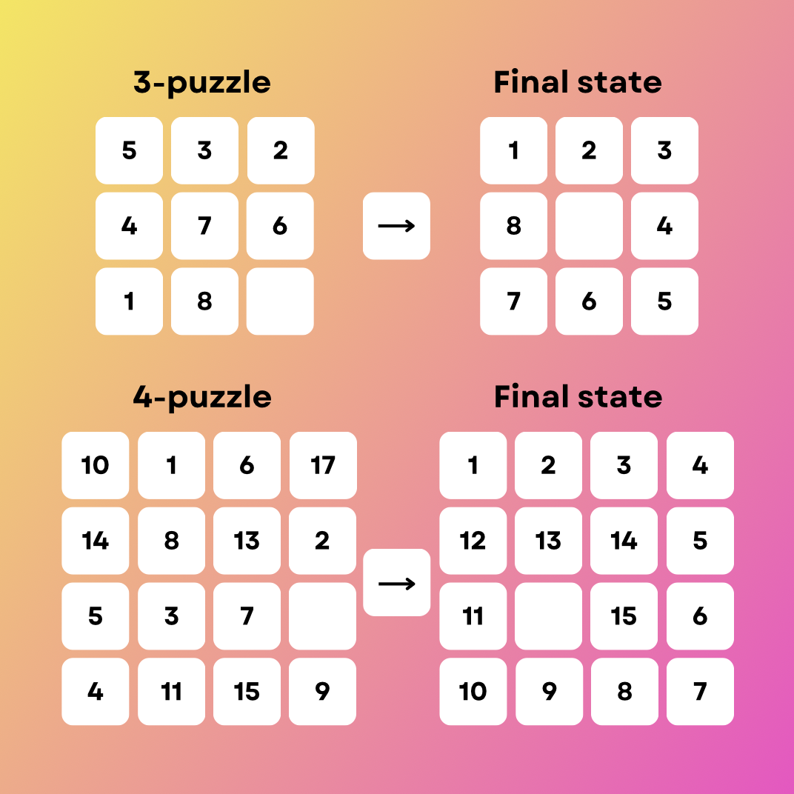

# N-Puzzle
_Solving the N-puzzle game using the A* search algorithm_

N Puzzle is a sliding blocks game that takes place on a k * k grid with ((k * k) - 1) tiles each numbered from 1 to N. The task is to reposition the tiles to their proper order. 

  

## To start the program
- Build the project  
`make`  

- Run the program with a puzzle from a file  
`make run FILE=[file_name]`  

- Run with randomly generated 3x3 puzzle (rebuilds the program)  
`make puzzle`  

- Run with puzzle according to the specified parameters (rebuilds the program)  
`make puzzle FLAGS='[-s] [-u] [-i]' SIZE='[size]`  
`size` — Size of the puzzle's side (3 by default)  
`-s` — Forces generation of a solvable puzzle  
`-u` — Forces generation of an unsolvable puzzle  
`-i` — Number of passes

- Delete all compiled and generated files  
`make clean`  

- Rebuild the project (without running it)  
`make re`

## Heuristics
To choose the heuristic function, in the file `heuristic.properties` change the value of key `heuristic` to:  
`manhattan`, `hamming` or `euclidean`  

### :gb: Manhattan distance (Taxicab, City-Block)
- Manhattan distance is a measure of the distance between two points in a grid-based
system (like a city grid) measured along the grid lines.
- It is named "Manhattan distance" because it reflects the distance a car would travel on a
grid of streets in Manhattan, where travel can only occur along north-south and east-west paths.
- The formula for Manhattan distance between two points $`(x_{1}, y_{1})`$ and $`(x_{2}, y_{2})`$ is given by: $`|x_{2} - x_{1}| + |y_{2} - y_{1}|`$    
### Hamming distance (Misplaced Tiles)
- It counts the number of positions at which the corresponding symbols (tiles) are different.
### Euclidean Distance 
- Euclidean distance is a measure of the straight-line distance between two points in Euclidean space.
- It is derived from the Pythagorean theorem and represents the length of the shortest path between two points.
- For two points $`(x_{1}, y_{1})`$ and $`(x_{2}, y_{2})`$ the Euclidean distance is given by: $`\sqrt{(x_{2} - x_{1})^2 + (y_{2} - y_{1})^2}`$

### :ru: Манхеттенское расстояние (Manhattan distance, Taxicab, City-Block)
- Манхеттенское расстояние представляет собой расстояние между двумя точками в системе на основе сетки.
- Оно названо "Манхеттенским расстоянием", потому что отражает расстояние, которое машина проезжает по сетке улиц в Манхэттене, где движение возможно только вдоль путей север-юг и запад-восток.
- Манхеттенского расстояния между двумя точками $`(x_{1}, y_{1})`$ и $`(x_{2}, y_{2})`$ вычесляется по формуле: $`|x_{2} - x_{1}| + |y_{2} - y_{1}|`$
### Количество неправильных плиток (Hamming distance, Misplaced Tiles)
- Подсчитывает количество плиток, находящихся не на своих местах в текущем состоянии пазла. Чем больше неправильных плиток, тем дальше текущее состояние от целевого.
### Евклидово расстояние (Euclidean Distance)
- Прямолинейное расстояния между двумя точками в евклидовом пространстве.
- Оно происходит из теоремы Пифагора и представляет собой длину кратчайшего пути между двумя точками.
- Для двух точек $`(x_{1}, y_{1})`$ и $`(x_{2}, y_{2})`$ Евклидово расстояние вычисляется по формуле: $`\sqrt{(x_{2} - x_{1})^2 + (y_{2} - y_{1})^2}`$

## A* algorithm

:gb: During the algorithm execution, the function $`f(v)=g(v)+h(v)`$ is computed for vertices
- $`g(v)`$ represents the minimal cost of the path to vertex $`v`$ from the starting vertex
- $`h(v)`$ is the heuristic estimation of the cost from vertex $`v`$ to the final goal
In essence, the function $`f(v)`$ denotes the length of the path to the goal, composed of the traversed distance $`g(v)`$ and the remaining distance $`h(v)`$. The smaller the value of $`f(v)`$, the earlier we will explore the vertex $`v`$, as it is assumed to reach the goal distance more efficiently. Vertices explored by the algorithm can be stored in a priority queue based on the value of $`f(v)`$. A* operates similarly to Dijkstra's algorithm, examining routes to the goal in order of their current optimality based on available information (heuristic function).

:ru: В процессе работы алгоритма для вершин рассчитывается функция $`f(v)=g(v)+h(v)`$ 
- $`g(v)`$ - наименьшая стоимость пути в $`v`$ из стартовой вершины, в нашем контексте - количество ходов (передвежений)
- $`h(v)`$ - эвристическое приближение стоимости пути от $`v`$ до конечной цели, в нашем контексте - 3 эвристические функции на выбор
Фактически, функция $`f(v)`$ — длина пути до цели, которая складывается из пройденного расстояния $`g(v)`$ и оставшегося расстояния $`h(v)`$. Исходя из этого, чем меньше значение $`f(v)`$, тем раньше мы откроем вершину $`v`$, так как через неё мы предположительно достигнем расстояние до цели быстрее всего. Открытые алгоритмом вершины можно хранить в очереди с приоритетом по значению $`f(v)`$. А* действует подобно алгоритму Дейкстры и просматривает среди всех маршрутов ведущих к цели сначала те, которые благодаря имеющейся информации (эвристическая функция) в данный момент являются наилучшими.

  
## Some variations of the A* algorithm

### :gb: Beam search
In the main A* loop, the "opened" set stores all the nodes that may need to be searched to find a path. The Beam Search is a variation of A* that places a limit on the size of the "opened" set. If the set becomes too large, the node with the worst chances of giving a good path is dropped. One drawback is that you have to keep your set sorted to do this, which limits the kinds of data structures you’d choose.

### Iterative deepening A* (IDA*)
The name comes from game tree searches, where you look some number of moves ahead. You can try to deepen the tree by looking ahead more moves. Once your answer doesn’t change or improve much, you assume that you have a pretty good answer, and it won’t improve. In IDA*, the “depth” is a cutoff for $`f(v)`$ values. When the $`f(v)`$ value is too large, the node won’t even be considered (i.e., it won’t be added to the OPEN set). The first time through you process very few nodes. Each subsequent pass, you increase the number of nodes you visit. If you find that the path improves, then you continue to increase the cutoff.

### Weighted A*
In Weighted A*, this estimated cost $`р(v)`$ is multiplied by a weight factor $`w`$ before being added to the actual cost $`g(v)`$ to form the evaluation function $`f(v)=g(v)+w*h(v)`$. This modification allows for adjusting the influence of the heuristic estimation on the selection of the next node to explore. By tuning this weight factor, one can control the trade-off between the speed of the search and the optimality of the path found.  
Dijsktra’s Algorithm uses only $`g(v)`$ and Greedy Best First Search uses only $`h(v)`$. The weight is a way to smoothly interpolate between these two algorithms, where a weight of 0 means Dijkstra’s Algorithm and a weight of ∞ means Greedy Best First Search. A weight of 1.0 is halfway between the two extremes, giving A*.

## B*

  
### :ru: Beam search (Поиск по лучу)
В основном цикле A* множество "opened" хранит все узлы, которые могут потребоваться для поиска пути. Поиск по лучу - вариация A*, которая устанавливает ограничение на размер множества "opened". Если набор становится слишком большим, узел с наименьшими шансами дать хороший путь исключается. Один из недостатков заключается в необходимости поддерживать отсортированное множество, что ограничивает выбор структур данных.

### Iterative deepening A* (Итеративное углубление)
Название происходит от поиск в игровом дереве (Game Tree Search - это метод, применяемый в теории игр и искусственном интеллекте для анализа возможных ходов в игре), при котором вы просматриваете некоторое количество ходов вперед. Вы можете попытаться углубить дерево, рассматривая больше ходов вперед. Когда ваш ответ перестает изменяться или улучшаться значительно, можно считать, что у вас уже есть довольно хороший ответ, и дальнейшее углубление не даст существенных улучшений. В IDA* "глубина" - это пороговое значение $`f(v)`$. Когда значение $`f(v)`$ слишком велико, узел даже не рассматривается (то есть его не добавляют в множество "opened"). Первый проход обрабатывает очень небольшое количество узлов. На каждом последующем проходе увеличивается количество посещаемых узлов. Если вы обнаружите, что путь улучшается, вы продолжаете увеличивать отсечение. 

### Weighted A* (Взвешенный A*)
При использовании Weighted A* для оценки общей стоимости пути от начальной вершины до цели умножается эвристическая оценка на некоторый коэффициент веса $`w`$ (обычно это положительное число): $`f(v)=g(v)+w*h(v)`$. Это позволяет увеличивать или уменьшать влияние эвристической функции на выбор следующего узла для раскрытия. 
Изменение веса эвристической функции позволяет настраивать баланс между скоростью поиска и точностью оптимальности найденного пути. Aлгоритм Дейсктры использует только $`g(v)`$, а жадный поиск по использует только $`h(v)`$. Вес — это способ плавной интерполяции между этими двумя алгоритмами, где вес 0 означает алгоритм Дейкстры, а вес ∞ означает жадный поиск наилучшего первого варианта. Вес 1,0 находится посередине между двумя крайностями.

## B* 
Как и A*, B* использует эвристическую оценку для принятия решения о том, какой путь следует исследовать дальше. Однако, в отличие от A*, B* позволяет динамически изменять свою оценку, улучшая качество найденного пути.

## Sources:
- [Red Blob Games](https://www.redblobgames.com)
- [Алгоритм A*](https://neerc.ifmo.ru/wiki/index.php?title=Алгоритм_A*)
- [Variants of A*](https://theory.stanford.edu/~amitp/GameProgramming/Variations.html)
- [Finding Optimal Solutions to the Twenty-Four Puzzle](https://cdn.aaai.org/AAAI/1996/AAAI96-178.pdf)
- [Solving the 15-Puzzle](https://cseweb.ucsd.edu//~ccalabro/essays/15_puzzle.pdf)
- [Shortest solution for the N-Puzzle is intractable](https://cdn.aaai.org/AAAI/1986/AAAI86-027.pdf)
- [Efficiently Searching the 15-Puzzle](https://era.library.ualberta.ca/items/2f674920-ad11-4e40-b7a0-e718cb23ebf6/view/fe341ba3-5fd9-456f-b305-e8b44caeb4a2/TR94-08.pdf)
- [IDA*](https://ru.wikipedia.org/wiki/Информированный_метод_поиска#IDA*)
- [B*](https://ru.wikipedia.org/wiki/Алгоритм_поиска_B*)
- [Solvable/Unsolvable](https://www.geeksforgeeks.org/check-instance-15-puzzle-solvable/)
